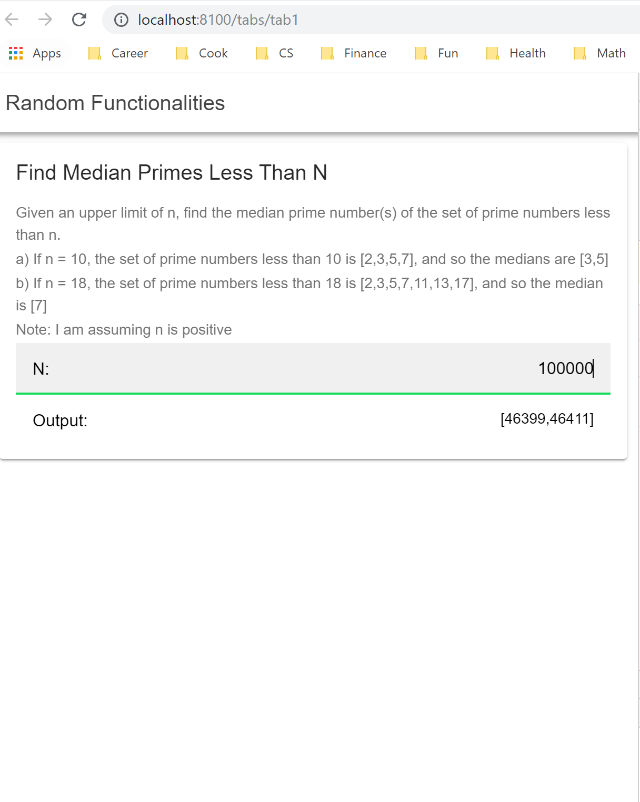
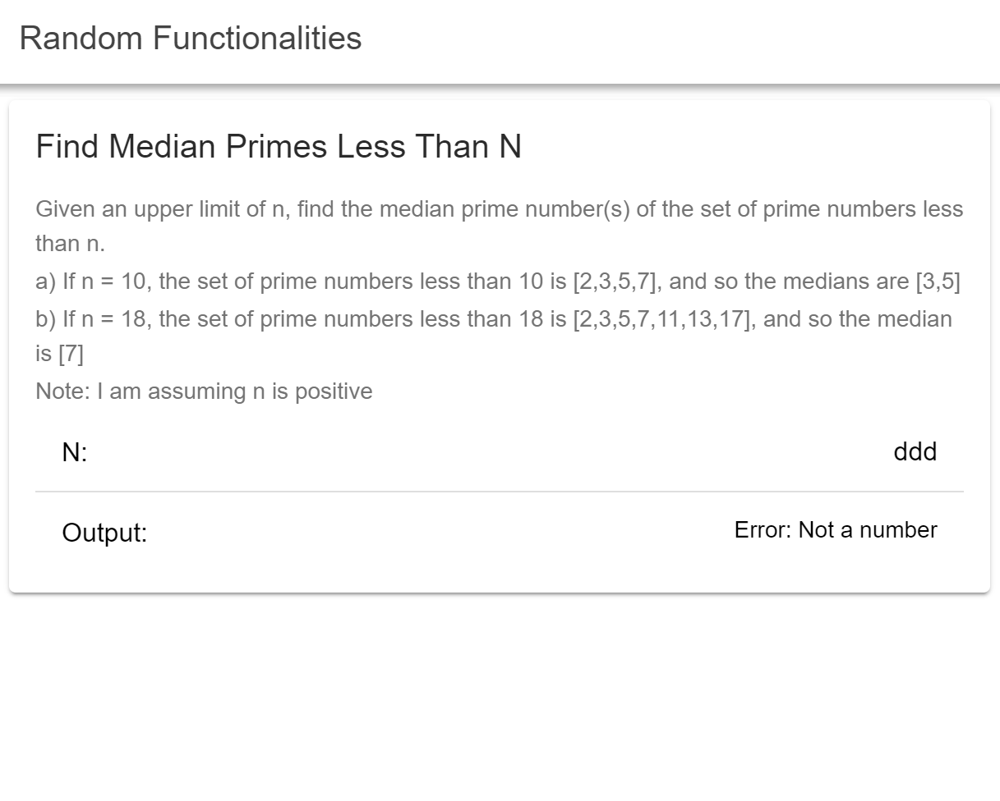
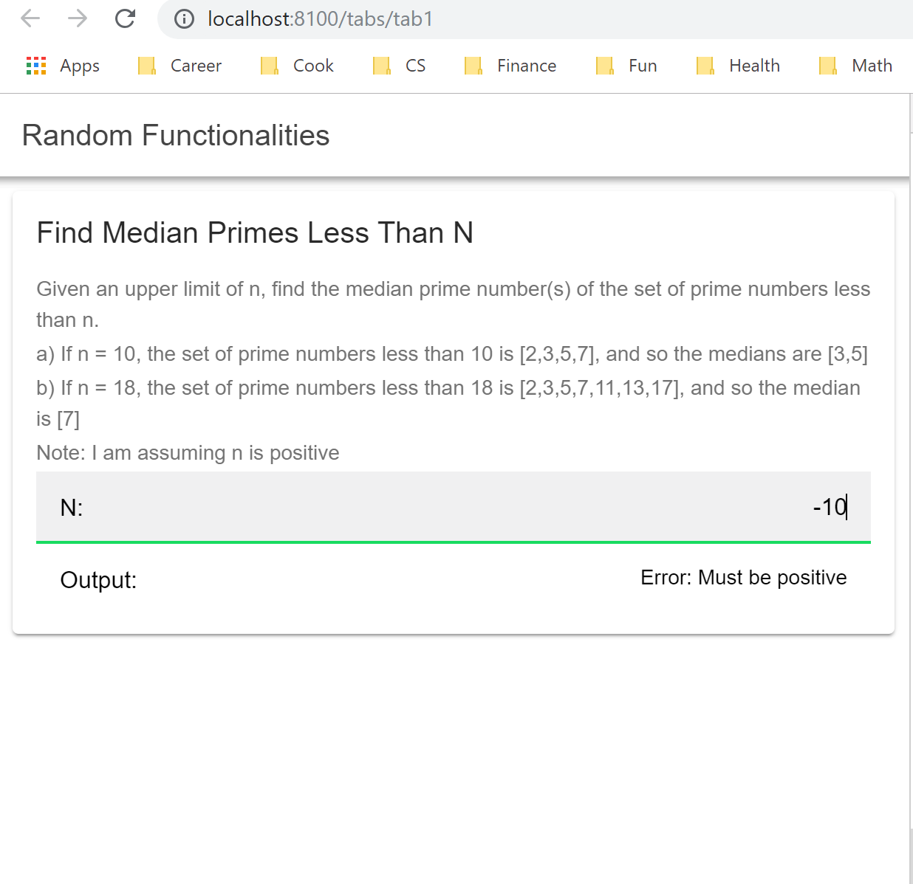

# Random Ionic Server
Random stuff

This server demo works. I separated backend and front end, ionic uses the API from this URL.
[Server demo on Heroku](https://jayde-randomionicserver.herokuapp.com)

[Server repo link](https://github.com/JaydeYue/RandomIonicServer)

## Currently have
Getting median of prime numbers before a positive N

# Setup

Using Ionic and Node.js for the backend. Make sure you have them installed

1. **Install Required libraries**

```bash
$ npm install
$ npm install -g cordova ionic
```

3. **Running locally**

```bash
$ ionic serve
```

Only tab 1 is in use, the other two tabs are placeholder.




3. **Test**

There are no unit tests for front end, please feel free to test on your web either locally.

4. **Troubleshoot**

Please google whatever build error you get:) If a build error persists or you find a bug, please contact me through my website. Thank you!
